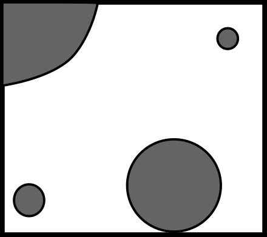
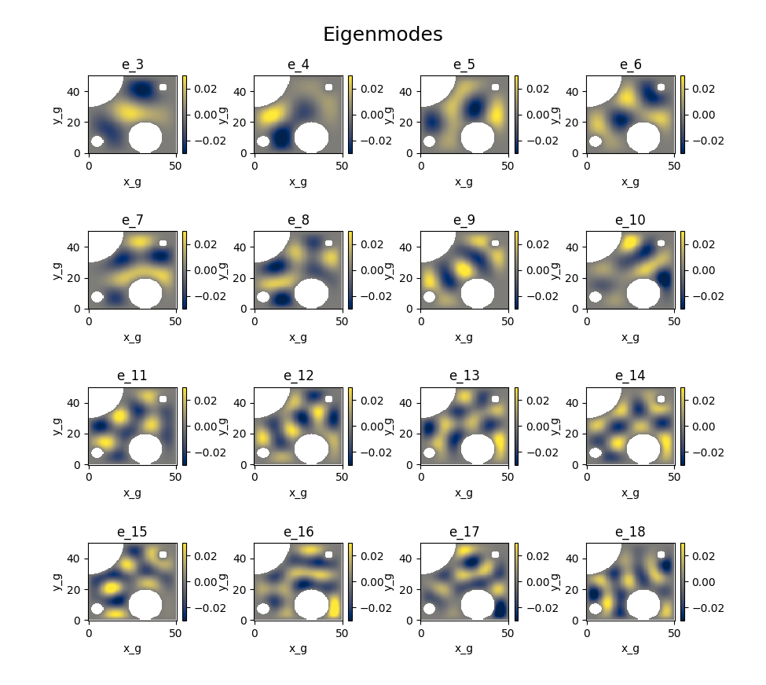
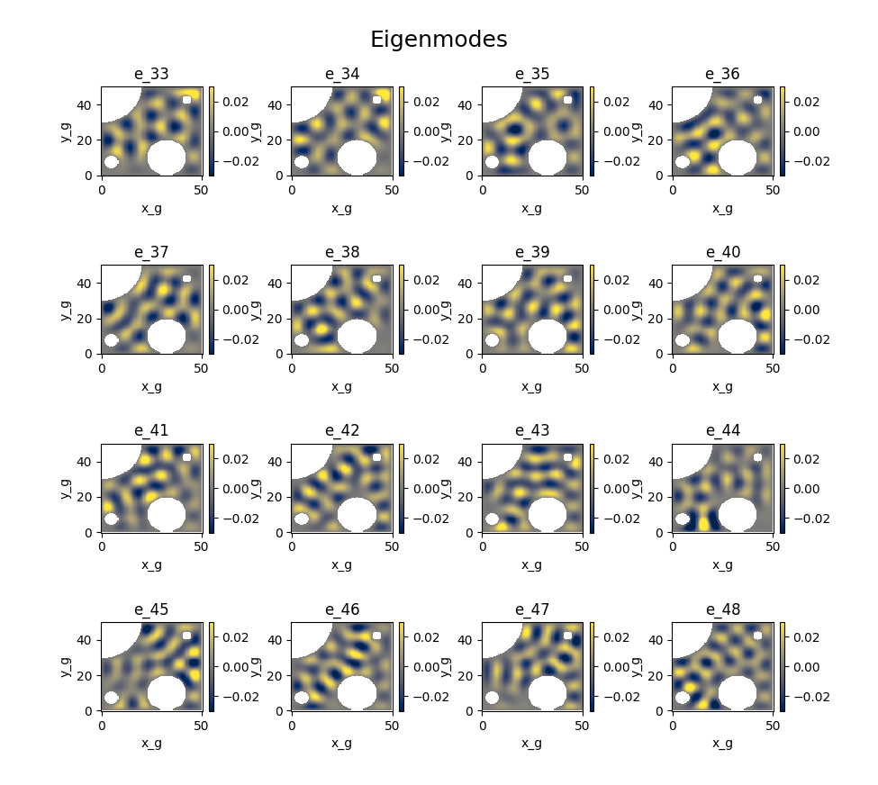
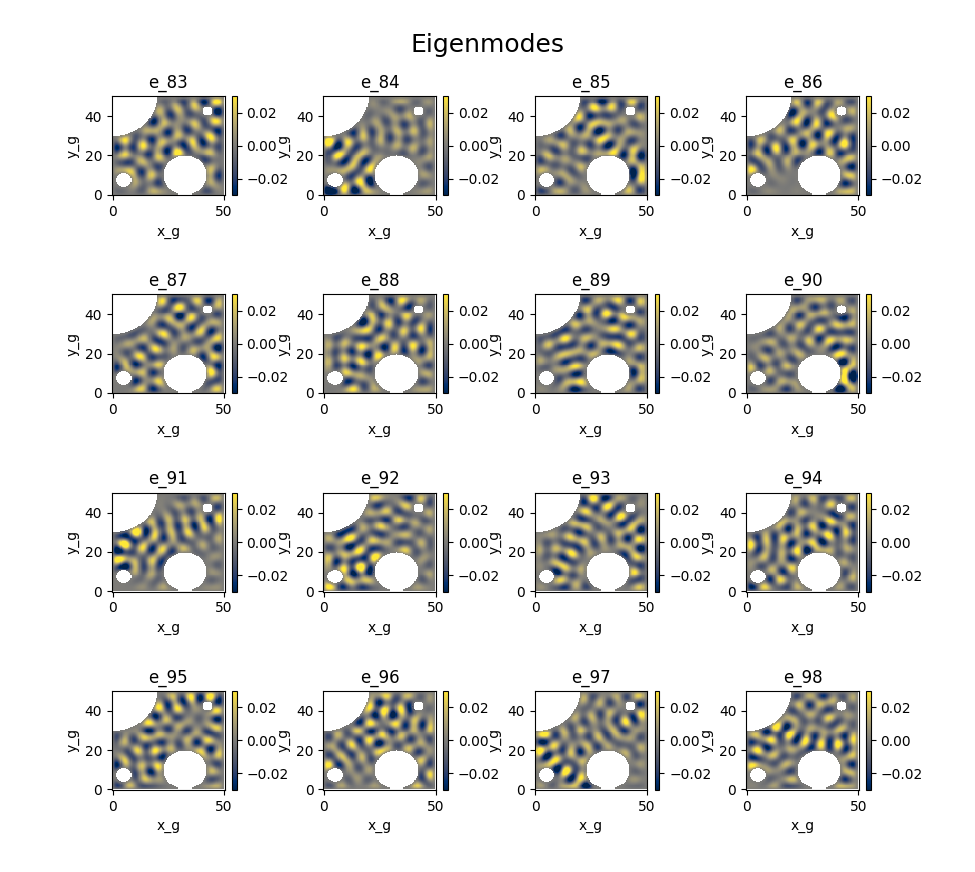

# Irregular Holes

In this example, we look at a domain that has holes placed throughout, to demonstrate how the `xnma` methodology handles irregular geometry. Specifically, we look at the basis functions that result from finding the eigenpairs with the smallest eigenvalues (largest length scales). This example can be found in [examples/eigenmodesIrregularHoles.py](https://github.com/FluidNumerics/xnma/blob/main/examples/eigenmodesIrregularHoles.py)

<figure markdown>
<center>
{ width=250 }
 <figcaption>Figure 1 : A schematic of the "irregular holes" domain. The gray regions indicate dry grid cells, and black lines denote the domain boundaries.</figcaption>
</center>
</figure>

A sketch of the model domain is shown above. The model is initialized and configured for this demo using the `irregularHolesDemo` method

```python

from xnma import nma

model = nma.model()
model.irregularHolesDemo(dx=0.5,dy=0.5,nx=101,ny=101)
```

We use 101 xg points and 101 yg points, giving 100x100 tracer cells in an Arakawa C-grid. Each grid cell has a grid spacing of 0.5 units, giving a domain dimensions of 50x50 units. The `irregularHolesDemo` method constructs a domain similar to what is shown in Figure 1.


We use the default settings of the `findEigenmodes` method, which uses the Implicitly Restarted Arnoldi Method ([`eigsh`]()) to find the 100 eigenpairs with the largest eigenvalues of the inverse of the Laplacian; this gives the 100 smallest eigenvalues (largest length scale modes) of the Laplacian.

```
model.findEigenmodes( nmodes = 100 )
```

A few of the eigenmodes are shown below

<figure markdown>
<center>
{ width=400 }
{ width=400 }
{ width=400 }
 <figcaption>Figure 2 : A few of the eigenmodes are shown here, ordered by the length scales (greatest to least).</figcaption>
</center>
</figure>
